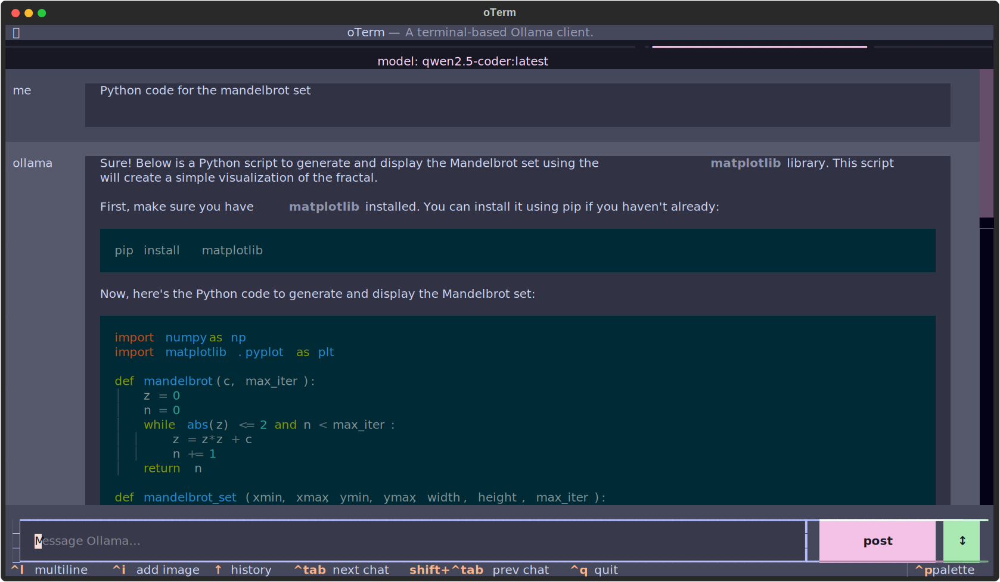

# oterm

the text-based terminal client for [Ollama](https://github.com/ollama/ollama).

## Features

* intuitive and simple terminal UI, no need to run servers, frontends, just type `oterm` in your terminal.
* multiple persistent chat sessions, stored together with system prompt & parameter customizations in sqlite.
* can use any of the models you have pulled in Ollama, or your own custom models.
* allows for easy customization of the model's system prompt and parameters.
* supports tools integration for providing external information to the model.

## Documentation

[oterm Documentation](https://ggozad.github.io/oterm/)

### Screenshots

The splash screen animation that greets users when they start oterm.

A view of the chat interface, showcasing the conversation between the user and the model.

The model selection screen, allowing users to choose and customize available models.

oTerm using the `git` MCP server to access its own repo.

The image selection interface, demonstrating how users can include images in their conversations.

oTerm supports multiple themes, allowing users to customize the appearance of the interface.

## License

This project is licensed under the [MIT License](LICENSE).
