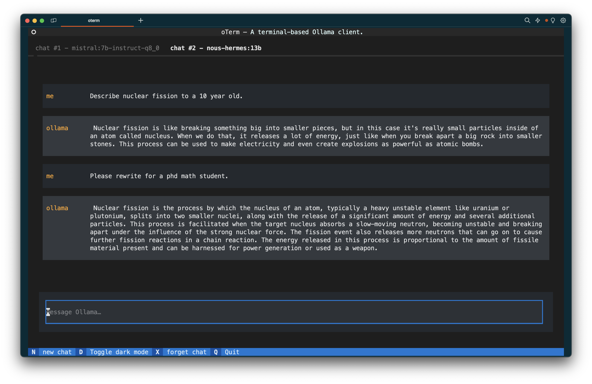
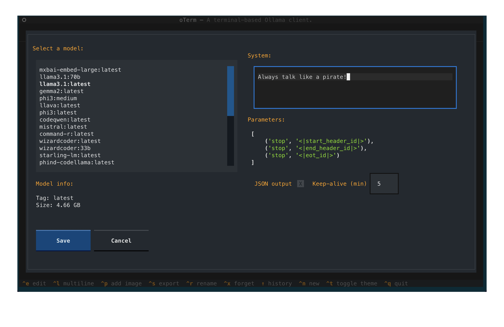
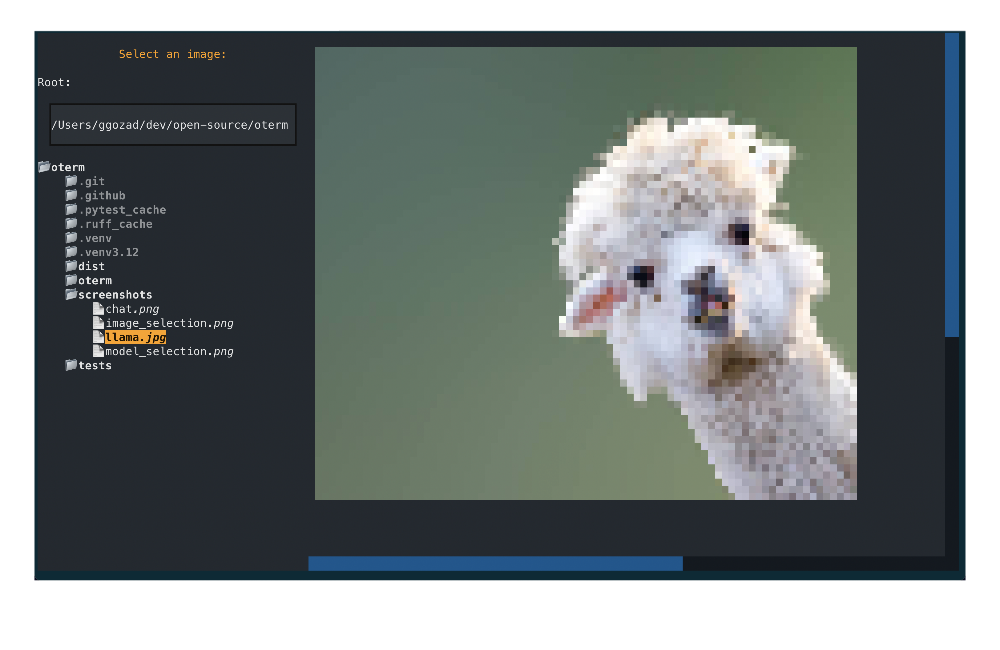

# oterm

the text-based terminal client for [Ollama](https://github.com/ollama/ollama).

# Table of Contents

- [oterm](#oterm)
- [Table of Contents](#table-of-contents)
  - [Features](#features)
  - [Installation](#installation)
    - [Ollama](#ollama)
    - [oterm](#oterm-1)
  - [Updating oterm](#updating-oterm)
  - [Using](#using)
    - [Commands](#commands)
    - [Keyboard shortcuts](#keyboard-shortcuts)
    - [Tools](#tools)
    - [Copy / Paste](#copy--paste)
    - [Customizing models](#customizing-models)
    - [Chat session storage](#chat-session-storage)
    - [App configuration](#app-configuration)
    - [Key bindings](#key-bindings)
    - [Screenshots](#screenshots)
  - [License](#license)

## Features

* intuitive and simple terminal UI, no need to run servers, frontends, just type `oterm` in your terminal.
* multiple persistent chat sessions, stored together with system prompt & parameter customizations in sqlite.
* can use any of the models you have pulled in Ollama, or your own custom models.
* allows for easy customization of the model's system prompt and parameters.
* supports tools integration for providing external information to the model.

## Installation

### Ollama

Ollama needs to be installed and running in order to use `oterm`. Please follow the [Ollama Installation Guide](https://github.com/ollama/ollama?tab=readme-ov-file#ollama).

### oterm

Using `brew` for MacOS:

```bash
brew tap ggozad/formulas
brew install ggozad/formulas/oterm
```

Using `yay` (or any AUR helper) for Arch Linux:

```bash
yay -S oterm
```

Using `pip`:

```bash
pip install oterm
```

## Updating oterm

To update oterm to the latest version, you can use the same method you used for installation:

Using `brew` for MacOS:

```bash
brew upgrade ggozad/formulas/oterm
```
Using 'yay' (or any AUR helper) for Arch Linux:

```bash
yay -Syu oterm
```
Using `pip`:

```bash
pip install --upgrade oterm
```

## Using

In order to use `oterm` you will need to have the Ollama server running. By default it expects to find the Ollama API running on `http://127.0.0.1:11434`. If you are running Ollama inside docker or on a different host/port, use the `OLLAMA_HOST` environment variable to customize the host/port. Alternatively you can use `OLLAMA_URL` to specify the full http(s) url. Setting `OTERM_VERIFY_SSL` to `False` will disable SSL verification.

```bash
OLLAMA_URL=http://host:port
```

To start `oterm` simply run:

```bash
oterm
```

### Commands
By pressing <kbd>^ Ctrl</kbd>+<kbd>p</kbd> you can access the command palette from where you can perform most of the chat actions. The following commands are available:

* `New chat` - create a new chat session
* `Edit chat parameters` - edit the current chat session (change system prompt, parameters or format)
* `Rename chat` - rename the current chat session
* `Export chat` - export the current chat session as markdown
* `Delete chat` - delete the current chat session  
* `Regenerate last Ollama message` - regenerates the last message from Ollama (will override the `seed` for the specific message with a random one.) Useful if you want to change the system prompt or parameters or just want to try again.
* `Pull model` - pull a model or update an existing one.
* `Change theme` - choose among the available themes.
  
### Keyboard shortcuts

The following keyboard shortcuts are supported:

* <kbd>^ Ctrl</kbd>+<kbd>q</kbd> - quit

* <kbd>^ Ctrl</kbd>+<kbd>l</kbd> - switch to multiline input mode
* <kbd>^ Ctrl</kbd>+<kbd>i</kbd> - select an image to include with the next message
* <kbd>↑</kbd>     - navigate through history of previous prompts

* <kbd>^ Ctrl</kbd>+<kbd>n</kbd> - open a new chat
* <kbd>^ Ctrl</kbd>+<kbd>Backspace</kbd> - close the current chat

* <kbd>^ Ctrl</kbd>+<kbd>Tab</kbd> - open the next chat
* <kbd>^ Ctrl</kbd>+<kbd>Shift</kbd>+<kbd>Tab</kbd> - open the previous chat

In multiline mode, you can press <kbd>Enter</kbd> to send the message, or <kbd>Shift</kbd>+<kbd>Enter</kbd> to add a new line at the cursor.

While Ollama is inferring the next message, you can press <kbd>Esc</kbd> to cancel the inference.

Note that some of the shortcuts may not work in a certain context, for example pressing <kbd>↑</kbd> while the prompt is in multi-line mode.

### Tools

Since version `0.6.0` `oterm` supports integration with tools. Tools are special "functions" that can provide external information to the LLM model that it does not otherwise have access to.

The following tools are currently supported:

* `date_time` - provides the current date and time in ISO format.
* `current_location` - provides the current location of the user (longitude, latitude, city, region, country). Uses [ipinfo.io](https://ipinfo.io) to determine the location.
* `current_weather` - provides the current weather in the user's location. Uses [OpenWeatherMap](https://openweathermap.org) to determine the weather. You need to provide your (free) API key in the OPEN_WEATHER_MAP_API_KEY environment variable.
* `shell` - allows you to run shell commands and use the output as input to the model. Obviously this can be dangerous, so use with caution.

The tooling API in Ollama does not currently support streaming. When using tools, you will have to wait for the tools & model to finish before you see the response.

Note that tools integration is **experimental** and may change in the future. I particularly welcome contributions for new tools, but please bear in mind that any additional requirements in terms of dependencies or paid-for API usage should be kept to a minimum.

### Copy / Paste

It is difficult to properly support copy/paste in terminal applications. You can copy blocks to your clipboard as such:

* clicking a message will copy it to the clipboard.
* clicking a code block will only copy the code block to the clipboard.

For most terminals there exists a key modifier you can use to click and drag to manually select text. For example:
* `iTerm`  <kbd>Option</kbd> key.
* `Gnome Terminal` <kbd>Shift</kbd> key.
* `Windows Terminal` <kbd>Shift</kbd> key.

### Customizing models

When creating a new chat, you may not only select the model, but also customize the the `system` instruction, `tools` used, as well as the `parameters` (such as context length, seed, temperature etc) passed to the model. For a list of all supported parameters refer to the [Ollama documentation](https://github.com/ollama/ollama/blob/main/docs/modelfile.md#valid-parameters-and-values). Checking the `JSON output` checkbox will force the model to reply in JSON format. All the models you have pulled or created will be available to `oterm`.

You can also "edit" the chat to change the system prompt, parameters or format. Note, that the model cannot be changed once the chat has started.

### Chat session storage

All your chat sessions are stored locally in a sqlite database. You can customize the directory where the database is stored by setting the `OTERM_DATA_DIR` environment variable.

You can find the location of the database by running `oterm --db`.

### App configuration

The app configuration is stored in a directory specific to your operating system, by default:

* Linux: `~/.local/share/oterm/config.json`
* macOS: `~/Library/Application Support/oterm/config.json`
* Windows: `C:/Users/<USER>/AppData/Roaming/oterm/config.json`

If in doubt you can get the directory where `config.json` can be found by running `oterm --data-dir`.

You can set the following options in the configuration file:
```json
{ "splash-screen": true }
```

`splash-screen` controls whether the splash screen is shown on startup.

### Key bindings

We strive to have sane default key bindings, but there will always be cases where your terminal emulator or shell will interfere. You can customize select keybindings by editing the app config `config.json` file. The following are the defaults:

```json
{
  ...
  "keymap": {
    "next.chat": "ctrl+tab",
    "prev.chat": "ctrl+shift+tab",
    "quit": "ctrl+q",
    "newline": "shift+enter"
  }
}
```

### Screenshots

The splash screen animation that greets users when they start oterm.



A view of the chat interface, showcasing the conversation between the user and the model.



The model selection screen, allowing users to choose from available models.



The image selection interface, demonstrating how users can include images in their conversations.


oTerm supports multiple themes, allowing users to customize the appearance of the interface.

## License

This project is licensed under the [MIT License](LICENSE).
