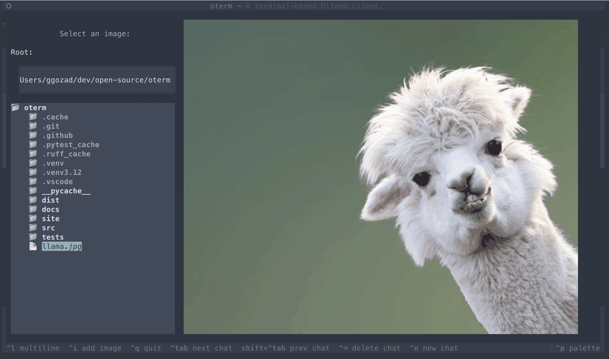
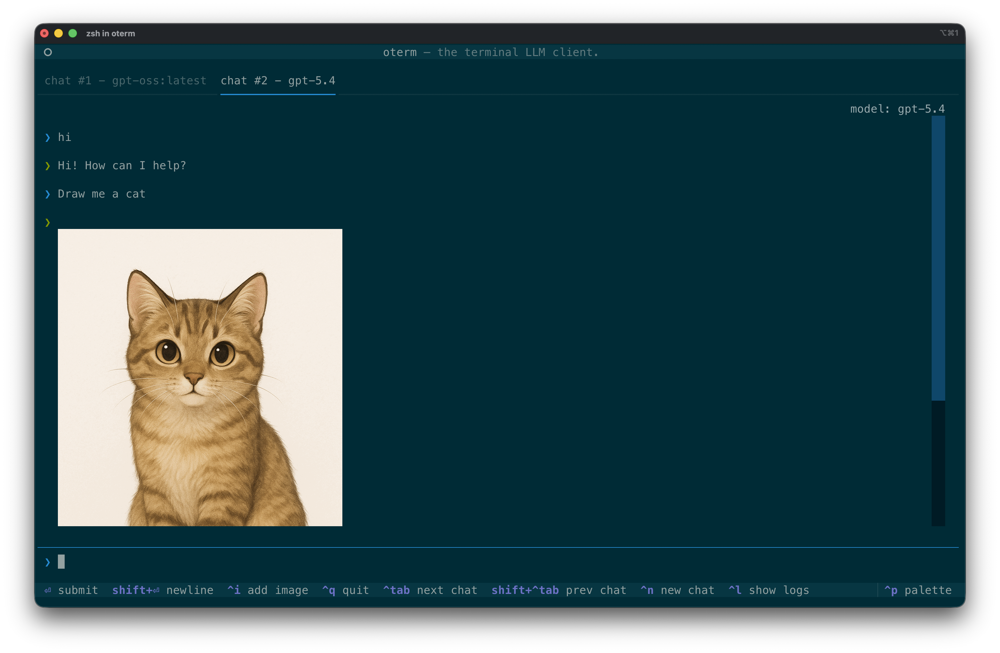

### Commands
By pressing <kbd>^ Ctrl</kbd>+<kbd>p</kbd> you can access the command palette from where you can perform most of the chat actions. The following commands are available:

* `New chat` - create a new chat session
* `Edit chat parameters` - edit the current chat session (change system prompt, tools, parameters, or thinking)
* `Rename chat` - rename the current chat session
* `Export chat` - export the current chat session as markdown
* `Delete chat` - delete the current chat session
* `Clear chat` - clear the chat history, preserving the chat configuration (provider, model, system prompt, tools, parameters, and thinking)
* `Regenerate last message` - regenerates the last assistant message. Useful if you want to change the system prompt or parameters, or just try again.
* `Prompt history` - browse previously sent prompts in the current chat and re-use one.
* `Show logs` - shows the logs of the current oterm session.

The palette also surfaces Textual's built-in commands (`Theme`, `Quit`, `Keys`, `Screenshot`, `Maximize`/`Minimize`).

### Keyboard shortcuts

The following keyboard shortcuts are supported:

* <kbd>^ Ctrl</kbd>+<kbd>q</kbd> - quit

* <kbd>Enter</kbd> - send the message
* <kbd>Shift</kbd>+<kbd>Enter</kbd> or <kbd>^ Ctrl</kbd>+<kbd>m</kbd> - insert a newline; the prompt grows to fit (up to 10 lines)
* <kbd>^ Ctrl</kbd>+<kbd>i</kbd> - select an image to include with the next message
* <kbd>↑/↓</kbd> (while messages are focused) - navigate through the messages
* <kbd>^ Ctrl</kbd>+<kbd>l</kbd> - show logs

* <kbd>^ Ctrl</kbd>+<kbd>n</kbd> - open a new chat

* <kbd>^ Ctrl</kbd>+<kbd>Tab</kbd> - open the next chat
* <kbd>^ Ctrl</kbd>+<kbd>Shift</kbd>+<kbd>Tab</kbd> - open the previous chat

The prompt is always a multi-line input that auto-grows as you type or paste; long lines wrap. To recall a previously sent prompt, open `Prompt history` from the command palette (<kbd>^ Ctrl</kbd>+<kbd>p</kbd>).

While the model is inferring the next message, you can press <kbd>Esc</kbd> to cancel the inference.

!!! note
    If the key bindings clash with your terminal, it is possible to change them by editing the configuration file. See [Configuration](app_config.md).

### Copy / Paste

It is difficult to properly support copy/paste in terminal applications. You can copy blocks to your clipboard as such:

* clicking a message will copy it to the clipboard.
* clicking a code block will only copy the code block to the clipboard.

For most terminals there exists a key modifier you can use to click and drag to manually select text. For example:
* `iTerm`  <kbd>Option</kbd> key.
* `Gnome Terminal` <kbd>Shift</kbd> key.
* `Windows Terminal` <kbd>Shift</kbd> key.

The image selection interface.

Images returned by the model are rendered inline in the chat. Click an image to save it to disk.
