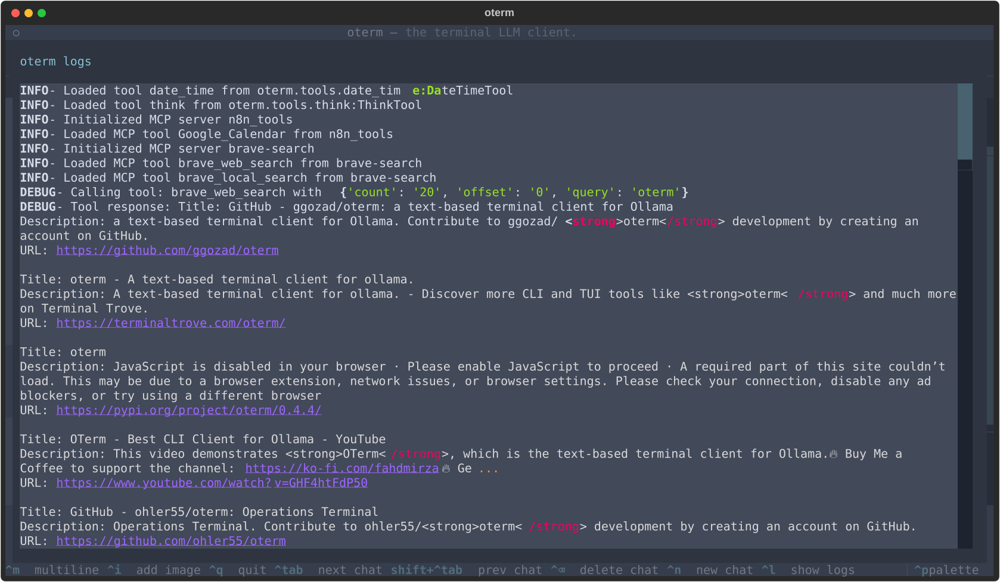

# Development & Debugging

## Inspecting logs

You can inspect basic logs from oterm by invoking the log viewer with <kbd>^ Ctrl</kbd>+<kbd>l</kbd> or by using the command palette. This is particularly useful if you want to debug tool calling.


oterm's internal log viewer showing the Brave Search MCP tool in action.

## Setup for development

```sh
git clone git@github.com:ggozad/oterm.git
cd oterm
uv sync
uv run oterm
```

Tests, linting and type checking:

```sh
uv run pytest
uv run ruff check
uv run ruff format
uv run ty check
```

### Debugging

To see oterm's log messages as they happen, start the Textual console in one terminal:

```sh
uv run textual console -x SYSTEM -x EVENT -x WORKER -x DEBUG
```

This hides most of Textual's own messages. Then start oterm in development mode in another:

```sh
uv run textual run -c --dev oterm
```

## Documentation

oterm uses [Zensical](https://zensical.org/) to generate the documentation, configured in `zensical.toml`. To serve it locally, run:
```sh
uv run zensical serve
```
and open the printed URL. `uv run zensical build` builds the static site.
