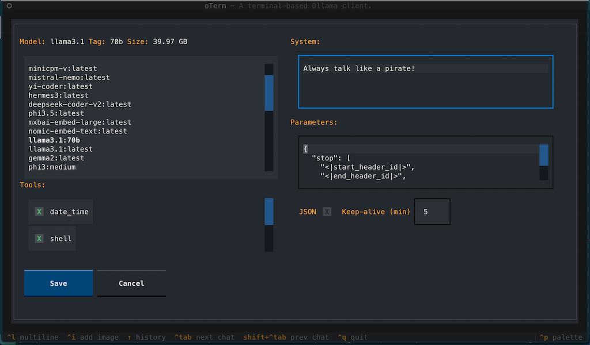

# oterm

the text-based terminal client for [Ollama](https://github.com/ollama/ollama).

## Features

* intuitive and simple terminal UI, no need to run servers, frontends, just type `oterm` in your terminal.
* multiple persistent chat sessions, stored together with system prompt & parameter customizations in sqlite.
* can use any of the models you have pulled in Ollama, or your own custom models.
* allows for easy customization of the model's system prompt and parameters.
* supports tools integration for providing external information to the model.

## Installation

### Ollama

Ollama needs to be installed and running in order to use `oterm`. Please follow the [Ollama Installation Guide](https://github.com/ollama/ollama?tab=readme-ov-file#ollama).

### oterm

Using `brew` for MacOS:

```bash
brew tap ggozad/formulas
brew install ggozad/formulas/oterm
```

Using `yay` (or any AUR helper) for Arch Linux:

```bash
yay -S oterm
```

Using `pip`:

```bash
pip install oterm
```

## Updating oterm

To update oterm to the latest version, you can use the same method you used for installation:

Using `brew` for MacOS:

```bash
brew upgrade ggozad/formulas/oterm
```
Using 'yay' (or any AUR helper) for Arch Linux:

```bash
yay -Syu oterm
```
Using `pip`:

```bash
pip install --upgrade oterm
```

## Using

In order to use `oterm` you will need to have the Ollama server running. By default it expects to find the Ollama API running on `http://127.0.0.1:11434`. If you are running Ollama inside docker or on a different host/port, use the `OLLAMA_HOST` environment variable to customize the host/port. Alternatively you can use `OLLAMA_URL` to specify the full http(s) url. Setting `OTERM_VERIFY_SSL` to `False` will disable SSL verification.

```bash
OLLAMA_URL=http://host:port
```

To start `oterm` simply run:

```bash
oterm
```


### Screenshots

The splash screen animation that greets users when they start oterm.


A view of the chat interface, showcasing the conversation between the user and the model.


The model selection screen, allowing users to choose from available models.


oTerm using the `git` MCP server to access its own repo.


The image selection interface, demonstrating how users can include images in their conversations.


oTerm supports multiple themes, allowing users to customize the appearance of the interface.

## License

This project is licensed under the [MIT License](LICENSE).
