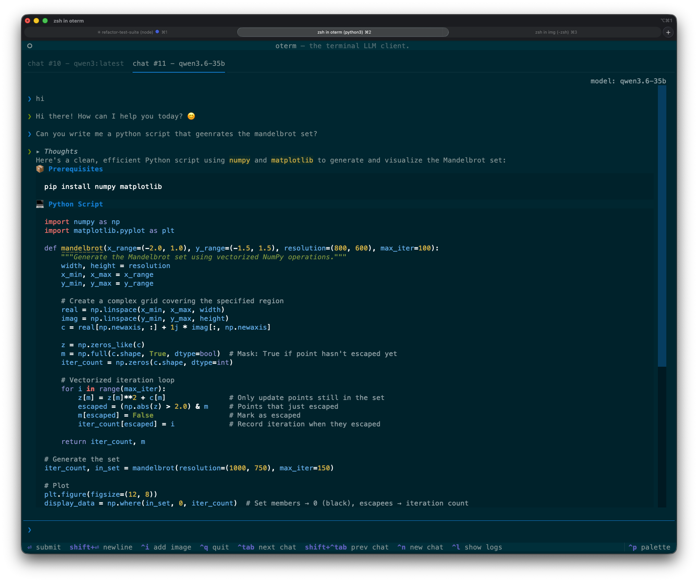

# oterm

the terminal client for [Ollama](https://github.com/ollama/ollama).

## Features

* intuitive and simple terminal UI, no need to run servers, frontends, just type `oterm` in your terminal.
* multiple persistent chat sessions, stored together with system prompt & parameter customizations in sqlite.
* support for Model Context Protocol (MCP) tools & prompts integration.
* can use any of the models you have pulled in Ollama, or your own custom models.
* allows for easy customization of the model's system prompt and parameters.
* supports tools integration for providing external information to the model.

## Installation

See the [Installation](installation.md) section.

## Using oterm

In order to use `oterm` you will need to have the Ollama server running. By default it expects to find the Ollama API running on `http://127.0.0.1:11434`. If you are running Ollama inside docker or on a different host/port, use the `OLLAMA_HOST` environment variable to customize the host/port. Alternatively you can use `OLLAMA_URL` to specify the full http(s) url. Setting `OTERM_VERIFY_SSL` to `False` will disable SSL verification.

```bash
OLLAMA_URL=http://host:port
```

To start `oterm` simply run:

```bash
oterm
```

If you installed oterm using `uvx`, you can also start it using:

```bash
uvx oterm
```

### Screenshots

The splash screen animation that greets users when they start oterm.


A view of the chat interface, showcasing the conversation between the user and the model.


oterm supports multiple themes, allowing users to customize the appearance of the interface.

## License

This project is licensed under the [MIT License](https://raw.githubusercontent.com/ggozad/oterm/main/LICENSE).
