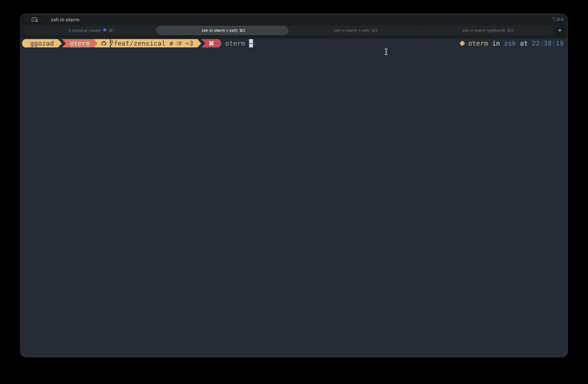
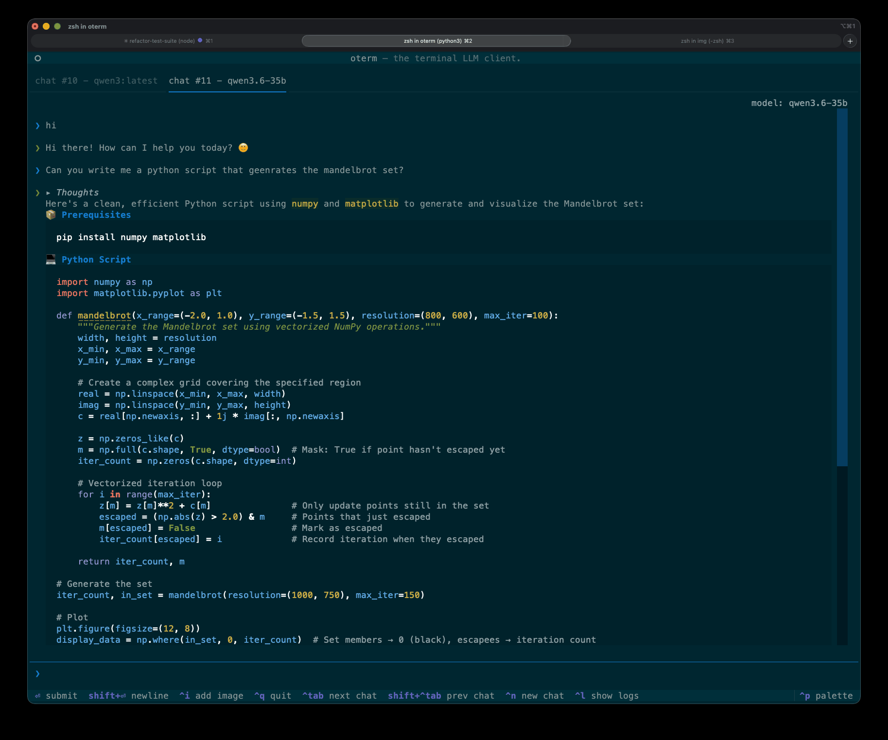
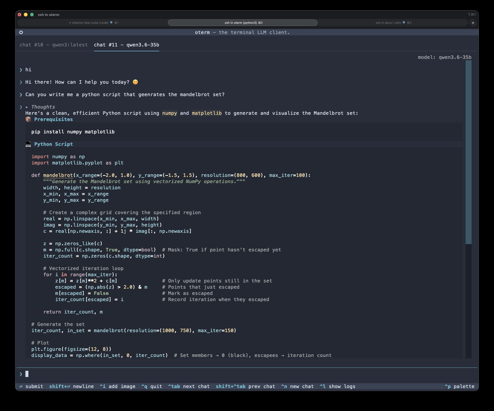

# oterm

the terminal client for [Ollama](https://github.com/ollama/ollama), OpenAI, Anthropic, and any [pydantic-ai](https://ai.pydantic.dev/)-supported provider.

## Features

* intuitive and simple terminal UI, no need to run servers, frontends, just type `oterm` in your terminal.
* supports Linux, MacOS, and Windows and most terminal emulators.
* multiple persistent chat sessions, stored together with system prompt & parameter customizations in sqlite.
* talks to Ollama, OpenAI, Anthropic, Google (AI / Vertex), Groq, Mistral, Cohere, AWS Bedrock, DeepSeek, Cerebras, Grok, Hugging Face, and any OpenAI-compatible endpoint — local (vLLM, LM Studio, llama.cpp, …) or hosted (OpenRouter, LiteLLM, …).
* tools — built-in (`shell`, `date_time`, `think`), custom Python plugins via entry points, and any [Model Context Protocol (MCP)](https://modelcontextprotocol.io) server.
* allows for easy customization of the model's system prompt and parameters.

## Installation

See the [Installation](installation.md) section.

## Using oterm

`oterm` picks up providers automatically from your environment. If [Ollama](https://github.com/ollama/ollama) is running on `http://127.0.0.1:11434` it shows up out of the box; for any other hosted provider, set the relevant API key (`OPENAI_API_KEY`, `ANTHROPIC_API_KEY`, etc.) and it appears in the provider dropdown. For other local runners (vLLM, LM Studio, llama.cpp, …) or hosted OpenAI-compatible endpoints (OpenRouter, LiteLLM, …), add an entry to the `openaiCompatible` section of `config.json`. See [Providers and API keys](app_config.md#providers-and-api-keys) and the [`openaiCompatible`](app_config.md#openaicompatible-custom-openai-compatible-endpoints) config block.

To point Ollama at a non-default host or disable SSL verification, see [Environment variables](app_config.md#environment-variables).

To start `oterm` simply run:

```bash
oterm
```

If you installed oterm using `uvx`, you can also start it using:

```bash
uvx oterm
```

### Screenshots

The splash screen animation that greets users when they start oterm.


A view of the chat interface, showcasing the conversation between the user and the model.


oterm supports multiple themes, allowing users to customize the appearance of the interface.

## License

This project is licensed under the [MIT License](https://raw.githubusercontent.com/ggozad/oterm/main/LICENSE).
