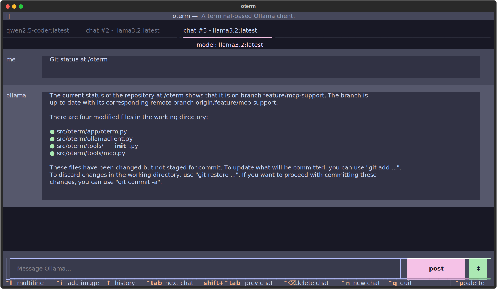
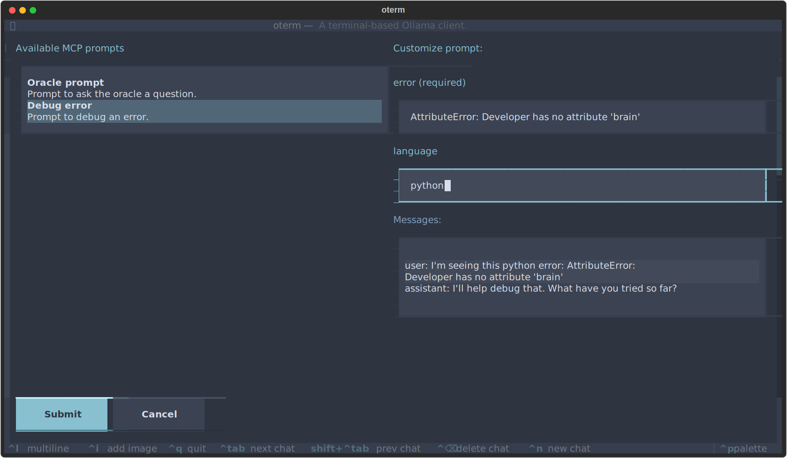

# Model Context Protocol

`oterm` has support for Anthropic's open-source [Model Context Protocol](https://modelcontextprotocol.io). While Ollama does not yet directly support the protocol, `oterm` attempts to bridge [MCP servers](https://github.com/modelcontextprotocol/servers) with Ollama.

To add an MCP server to `oterm`, simply add the server shim to oterm's `config.json`. For example for the [git](https://github.com/modelcontextprotocol/servers/tree/main/src/git) MCP server you would add something like the following to the `mcpServers` section of the `oterm` [configuration file](../app_config.md):

```json
{
  ...
  "mcpServers": {
    "git": {
      "command": "docker",
      "args": [
        "run",
        "--rm",
        "-i",
        "--mount",
        "type=bind,src=/Users/ggozad/dev/open-source/oterm,dst=/oterm",
        "mcp/git"
      ]
    }
  }
}
```

`oterm` supports the `stdio` MCP protocol. If the server you connect uses the `SSE` protocol, you can run it through a proxy such as [mcp-remote](https://github.com/geelen/mcp-remote) or [mcp-proxy](https://github.com/sparfenyuk/mcp-proxy) by having a config like:

```json
{
  ...
  "mcpServers": {
    "server_name": {
      "command": "npx",
      "args": [
        "-y",
        "mcp-remote@latest",
        "http://host/endpoint/sse",
      ]
    }
  }
}
```

### Supported MCP Features
#### Tools
By transforming [MCP tools](https://modelcontextprotocol.io/docs/concepts/tools) into Ollama tools `oterm` provides full support.

!!! note
    Not all models are equipped to support tools. For those models that do not, the tool selection will be disabled.

    A lot of the smaller LLMs are not as capable with tools as larger ones you might be used to. If you experience issues with tools, try reducing the number of tools you attach to a chat, increase the context size, or use a larger LLM.



oterm using the `git` MCP server to access its own repo.

#### Prompts
`oterm` supports [MCP prompts](https://modelcontextprotocol.io/docs/concepts/prompts). Use the "Use MCP prompt" command to invoke a form with the prompt. Submitting will insert the prompt messages into the chat.


oterm displaying a test MCP prompt.

#### Sampling
`oterm` supports [MCP sampling](https://modelcontextprotocol.io/docs/concepts/sampling), acting as a geteway between Ollama and the servers it connects to. This way, an MCP server can request `oterm` to run a *completion* and even declare its model preferences and parameters!
