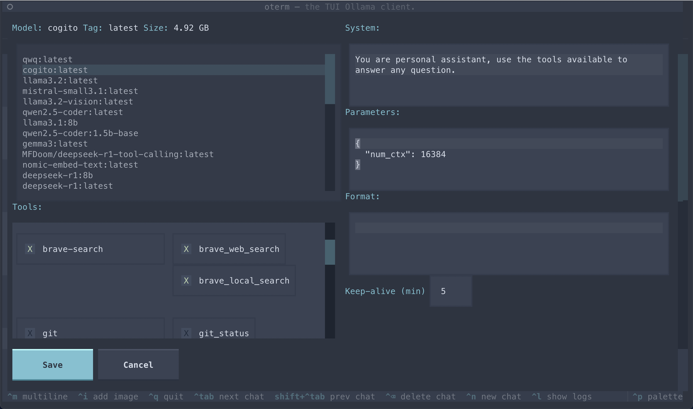

When creating a new chat, you may select the model you want and customize the following:

- `system` instruction prompt
- `tools` used. See [Tools](tools/index.md) for more information on how to make tools available.
- chat `parameters` (such as context length, seed, temperature etc) passed to the model. For a list of all supported parameters refer to the [Ollama documentation](https://github.com/ollama/ollama/blob/main/docs/modelfile.md#valid-parameters-and-values).
- Ouput `format`/structured output. In the format field you can use Ollama's [Structured Output](https://ollama.com/blog/structured-outputs) specifying the full format as a JSON schema. Leaving the field empty (default) will return the output as text.
- enable `thinking` for models that support it.
!!! note
    When `thinking` is enabled you will observe the model thinking while generating its response. The thinking process is not persisted in the database in order to save context, so you will not see it on later sessions.
You can also "edit" an existing chat to change the system prompt, parameters, tools or format. Note, that the model cannot be changed once the chat has started.

The model selection screen, allowing users to choose and customize available models.
