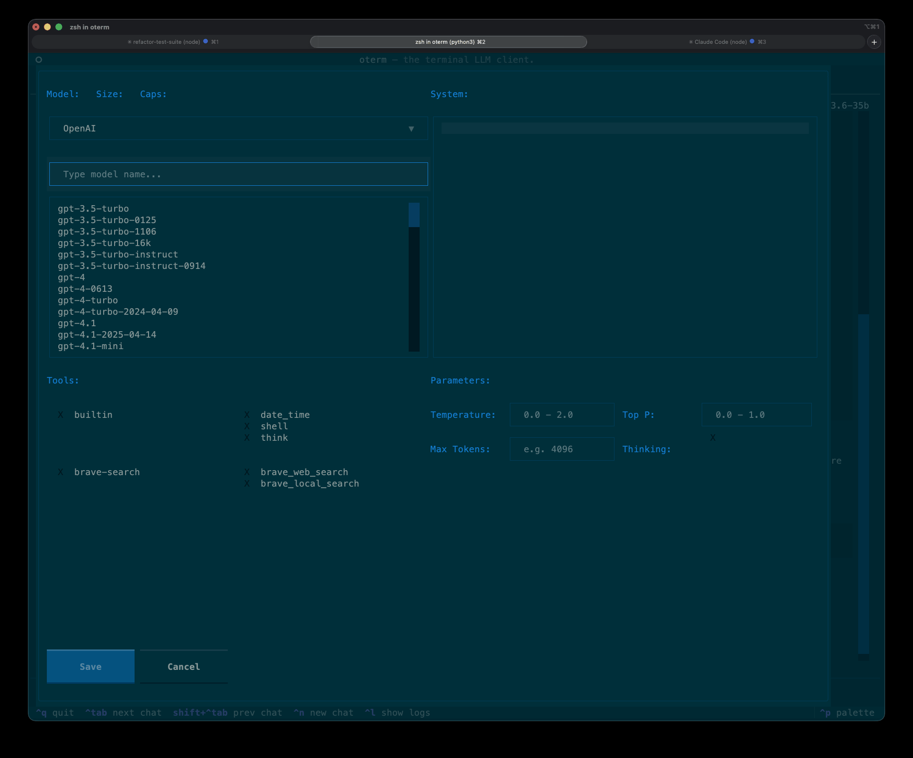

When creating a new chat, you may select the provider and model you want and customize the following:

- `system` instruction prompt
- `tools` used. See [Tools](tools/index.md) for more information on how to make tools available.
- chat `parameters` passed to the model: `temperature`, `top_p`, and `max_tokens`.
- enable `thinking` for models that support it.
!!! note
    When `thinking` is enabled you will observe the model thinking while generating its response. The thinking process is not persisted in the database in order to save context, so you will not see it on later sessions.
You can also "edit" an existing chat to change the system prompt, parameters, tools, or thinking. Note that the provider and model cannot be changed once the chat has started.

The model selection screen, allowing users to choose and customize available models.
