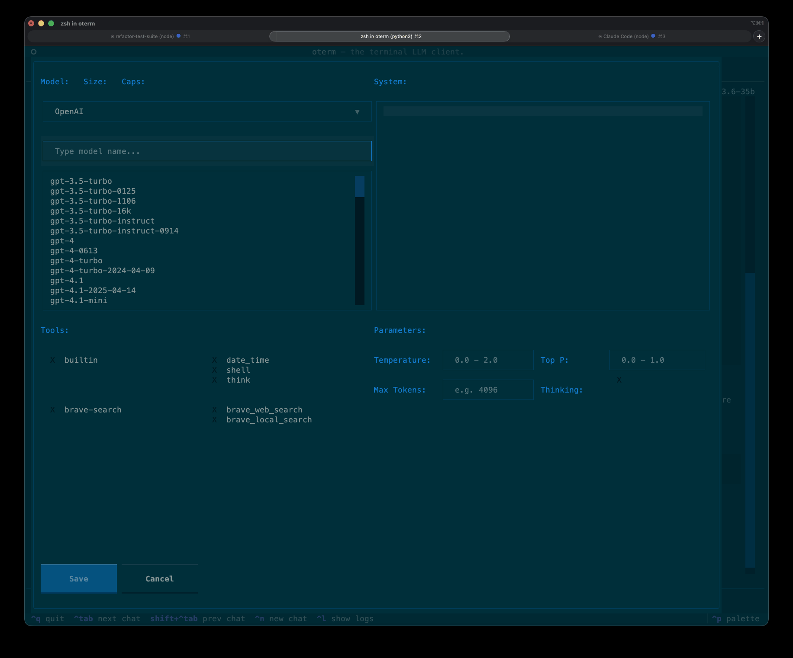

# Chat parameters

When creating a new chat, you may select the provider and model you want and customize the following:

- `system` instruction prompt
- `tools` used. See [Tools](tools/index.md) for more information on how to make tools available.
- chat `parameters` passed to the model: `temperature`, `top_p`, `max_tokens` and `seed`.
- enable `thinking` for models that support it.

!!! note
    When `thinking` is enabled you will observe the model thinking while generating its response. The thinking process is not persisted in the database in order to save context, so you will not see it on later sessions.

You can also "edit" an existing chat to change the system prompt, parameters, tools, or thinking. The provider and model cannot be changed after the chat is created.

The new-chat screen, where you pick the provider and model and customize the system prompt, tools, parameters, and thinking.
