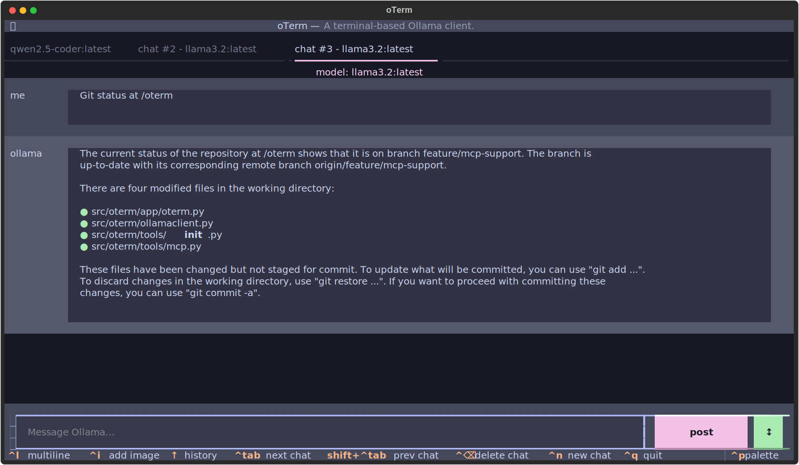

### Model Context Protocol support

`oterm` has support for Anthropic's open-source [Model Context Protocol](https://modelcontextprotocol.io). While Ollama does not yet directly support the protocol, `oterm` bridges [MCP servers](https://github.com/modelcontextprotocol/servers) with Ollama by transforming MCP tools into Ollama tools.

To add an MCP server to `oterm`, simply add the server shim to oterm's `config.json`. For example for the [git](https://github.com/modelcontextprotocol/servers/tree/main/src/git) MCP server you would add something like the following to the `mcpServers` section of the `oterm` configuration file:

```json
{
  ...
  "mcpServers": {
    "git": {
      "command": "docker",
      "args": [
        "run",
        "--rm",
        "-i",
        "--mount",
        "type=bind,src=/Users/ggozad/dev/open-source/oterm,dst=/oterm",
        "mcp/git"
      ]
    }
  }
}
```


oterm using the `git` MCP server to access its own repo.
